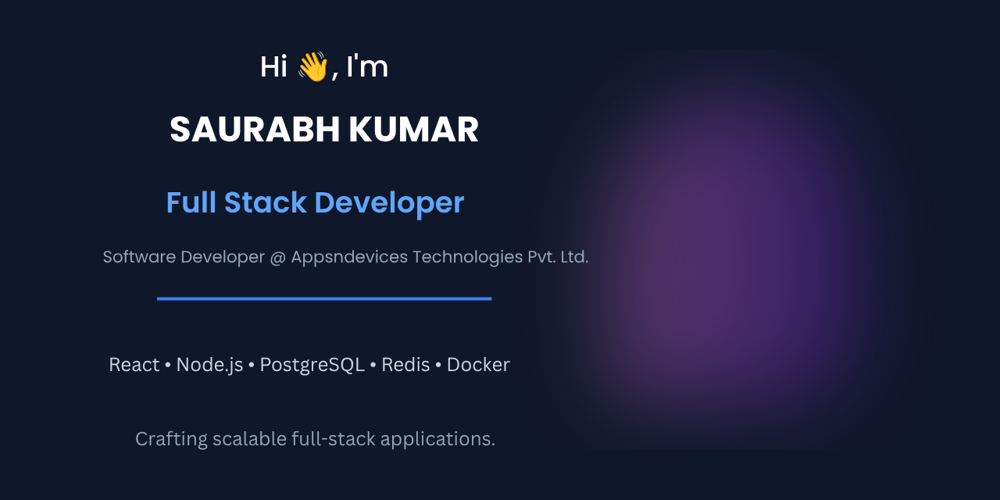

  

 

  

  

  

---

# 👋 About Me

I'm a **Full Stack Developer** with **2.5+ years of experience** building scalable web applications using modern JavaScript technologies.

Currently working as a **Software Developer at Appsndevices Technologies Pvt. Ltd.**, where I build production-ready applications, REST APIs, authentication systems, and scalable backend services.

I enjoy solving engineering problems, improving application performance, and designing maintainable backend architectures.

- 💼 Software Developer @ **Appsndevices Technologies Pvt. Ltd.**
- 📍 Bengaluru, India
- 🚀 Building scalable SaaS applications
- ⚡ Interested in Backend Architecture & Performance Optimization
- 🌱 Currently learning Microservices, Kubernetes, AWS & System Design

---

# 🛠 Tech Stack

### Frontend

### Backend

### Database

### DevOps & Tools

---

# 🌱 Currently Learning

- Microservices Architecture
- Docker & Containerization
- Kubernetes
- AWS
- PostgreSQL Performance Tuning
- System Design

---

# 💡 Engineering Philosophy

- Clean, readable and maintainable code
- Performance-first mindset
- Security by design
- Build reusable components
- Keep learning every day

---

# 📈 GitHub Stats

---

# 📫 Connect With Me

- 📧 **Email:** saurabhkumar4040@gmail.com
- 💼 **LinkedIn:** https://linkedin.com/in/saurabh-kumar-99009b24a
- 💻 **GitHub:** https://github.com/krsaurabh007
- 🧑‍💻 **HackerRank:** https://www.hackerrank.com/profile/saurabhkumar4040

---

⭐ Thanks for visiting my profile!

