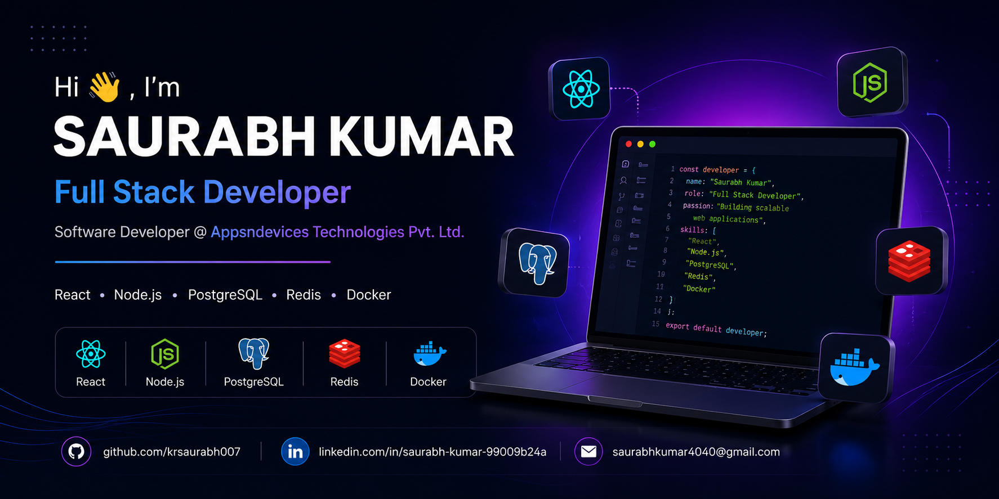

  

<h1 align="center">Hi, I'm Saurabh Kumar 👋</h1>

<h3 align="center">Full Stack Developer · React, Node.js, PostgreSQL I build secure SaaS apps and AI-powered features</h3>

  
  
  

---

## 👨‍💻 About me

I'm a Full Stack Developer with **2.7+ years of experience**, currently a Software Developer at **Appsndevices Technologies Pvt. Ltd.** in Bengaluru. I build React and Node.js applications, secure authentication systems and REST APIs, and lately AI features such as LLM tool-calling with MCP and RAG pipelines.

- 💼 Software Developer at Appsndevices Technologies Pvt. Ltd.
- 📍 Bengaluru, India
- 🔭 Next up: an AI agent project in Python and FastAPI, using MCP
- 🌱 Learning: microservices, Kubernetes, AWS, system design and PostgreSQL performance tuning

---

## 🚀 Featured projects

| Project | What it shows | Stack | Links |
|---|---|---|---|
| **TenantIQ** Multi-tenant SaaS | A separate PostgreSQL schema for every organization. JWT sessions in `httpOnly` cookies, Redis refresh-token blacklisting and rate limiting, role-based access (Admin, Manager, Viewer), Kanban board and analytics | React, TypeScript, Node.js, PostgreSQL, Redis, Docker | [Live demo](https://tenantiq-frontend.vercel.app) · [Code](https://github.com/krsaurabh007/TenantIQ) |
| **RAG From Scratch** Document Q&A with local LLMs | A RAG pipeline built without LangChain: token-aware chunking, hybrid search (pgvector + full-text, merged with Reciprocal Rank Fusion), document routing and grounded answers | Node.js, React, PostgreSQL + pgvector, Ollama | [Code](https://github.com/krsaurabh007/rag-from-scratch) |

---

## 💼 What I build

End to end: from the React UI, through the API and database, to containers and deployment.

**Frontend**
- React and TypeScript apps with TanStack React Query, lazy loading, memoization and code splitting for fast data fetching and rendering
- Shared state with Zustand (and Redux in earlier work), and responsive UIs with Tailwind CSS and Material-UI

**Backend**
- Modular REST APIs with Node.js and Express that power frontend workflows and business logic
- JWT authentication with refresh tokens and role-based access control to protect resources and user sessions
- Integrations with third-party financial and utility APIs, including webhook callbacks for asynchronous transaction updates
- PostgreSQL database design, with logic that avoids unnecessary database queries
- In TenantIQ: Redis-backed token blacklisting and rate limiting, Docker Compose and a GitHub Actions CI/CD pipeline

**AI**
- An **AI chat panel** that fills in question papers from natural-language input, cutting manual paper-creation time
- **LLM tool-calling with MCP**, so the AI queries application data on demand instead of relying on static prompts
- Prompt and context-handling logic that improves tool selection and response relevance

---

## 🛠 Tech stack

| | |
|---|---|
| **Frontend** |  |
| **Backend** |  |
| **Databases** |  |
| **DevOps and tools** |  |
| **AI and LLM** |     |

---

## 🎯 What I care about

- **Security by design.** In TenantIQ: `httpOnly` refresh-token cookies, Redis token blacklisting and login rate limiting.
- **Understanding over shortcuts.** I built a full RAG pipeline by hand before reaching for a framework, so I know why each step exists and how it fails.
- **Clean, maintainable code.** Reusable components, clear boundaries and configuration kept out of code.
- **Performance.** The right index for each access pattern, and measuring where time actually goes.

---

## 📫 Let's connect

I'm always happy to talk about web engineering, AI features and building software. Reach me on [LinkedIn](https://www.linkedin.com/in/saurabh-kumar-99009b24a) or at **saurabhkumar4040@gmail.com**.

  ⭐ Thanks for visiting my profile!

